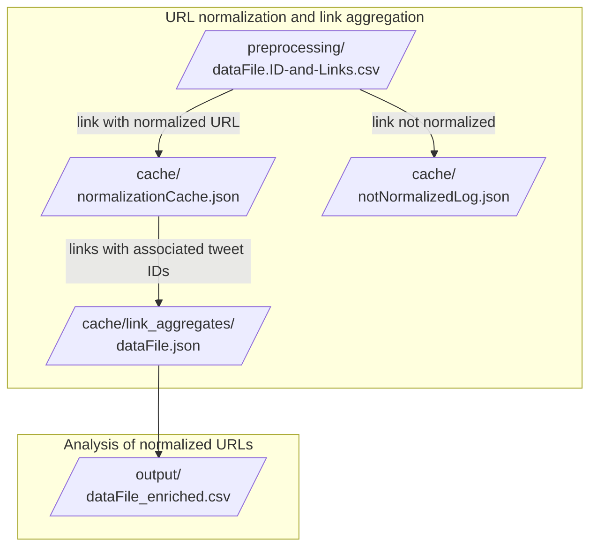

# Analyze Links in Twitter Data

This program parses URLS in datasets conforming to Twitter API's export and/or [Gazouilloire](https://github.com/medialab/gazouilloire), a long-term tweet collection tool from Science Po's médialab. From a dataset, the program extracts tweets' IDs and linked URLs. It then yields a CSV file with enriched metadata about valid, active URLS. The enrichments includes (1) agregated counts about the URL in the dataset, (2) metadata about the URL itself, and (3) metadata about certain social media sites if the URL is from one of the studied sources.

---
---
# States of the data

## 1. Raw data input to program
The incoming data file must have an ID for each tweet and a column containing the URLs linked to the tweet. If a tweet contains multiple URLs (i.e. tweet `1565043914381434881`), they must be separated by a pipe `|`. Twitter's API returns data already in this format, as does Gazouilloire.

|id|...|links|
|-|-|-|
|1564138363136909312|...||
|1565043914381434881|...|https://www.youtube.com/watch?v=4acSVmN3XT4\|https://twitter.com/kingsdh/status/1597146442430578690|
|1564626931353616386|...|https://www.youtube.com/watch?v=4acSVmN3XT4|
1555931971188150272|..|https://twitter.com/kingsdh/status/1597146442430578690|

---
## 2. Preprocessing the data

Using the Rust tool `xsv`, the program preprocesses the data. First, it removes everything but the ID and links columns. Second, it creates a unique row for every link, "exploding" links that might have been concatenated and separated by a pipe (i.e. tweet `1565043914381434881`). Finally, it removes any tweets which do not contain links (i.e. tweet `1564138363136909312`), yielding a cleaned dataset that can be accessed later in the directory `preprocessing/`.

|id|links|
|-|-|
|1565043914381434881|https://www.youtube.com/watch?v=4acSVmN3XT4|
|1565043914381434881|https://twitter.com/kingsdh/status/1597146442430578690|
|1564626931353616386|https://www.youtube.com/watch?v=4acSVmN3XT4|
1555931971188150272|https://twitter.com/kingsdh/status/1597146442430578690|

---
## 3. Enriched data output to CSV file

Using its Python scripts, the program then analyzes all the links in the preprocessed dataset and yields an enriched CSV with the following fields:

|raw_url|normalized_url|count|ids|domain|subdomain|hostname|twitter_user|youtube_channel_name|youtube_channel_id|youtube_channel_link|facebook_group_name|facebook_group_id|
|--|--|--|--|--|--|--|--|--|--|--|--|--|
|https://www.youtube.com/watch?v=4acSVmN3XT4|youtube.com/watch?v=4acSVmN3XT4|2|1565043914381434881\|1564626931353616386|youtube.com|youtube.com|youtube.com|[none]|[none]|UCLq9OzDa0HBnj_sNyEkdZJg|https://youtube.com/channel/UCLq9OzDa0HBnj_sNyEkdZJg|[none]|[none]|

---
---

# Program requirements
The program requires Python 3.10 (and some libraries) as well as a tool coded in Rust named `xsv`, which is called during the bash script and used to parse the incoming CSV file(s). To install `xsv`, follow the instructions for [the forked version maintained by Sciences Po's médialab](https://github.com/medialab/xsv).

# How-to

1. Clone this repository and change to that directory.
```shell
$ git clone https://github.com/kat-kel/cactus-robot
$ cd cactus-robot
```

2. Create and activate a new virtual environment for Python (version 3.10).

3. In that virtual Python environment, install the Python dependencies listed in the `requirements.txt` file.

4. While still in the directory `cactus-robot/`, launch the program by calling the bash script with the necessary options.

# File systems

## Directly work with one CSV file
Analyze links in one Twitter or Gazouilloire export. This file can either be open with the extension `.csv` or it can be compressed with the extension `.csv.gz`. The incoming file is never modified, only read.

```shell
$ ./run.sh -f FILE.CSV
```

## Iterate through CSV files in a directory

Analyze links in a batch of Twitter or Gazouilloire exports stored inside a directory. The program will only process files in the directory with either `.csv` or `.csv.gz` as the extension. The incoming files are never modified, only read.

```shell
$ ./run.sh -f DIRECTORY/
```

# Files created during the program's execution
To optimize performance, the program creates several data files in the directory `./cache/`. The file `./cache/notNormalizedLog.json` holds a log of links which the program is not capable of analyzing. The file `./cache/normalizationCache.json` records links whose resolution and/or normalization a previous execution of the program has already done. Both file types are JSON so that the Python script deserializes the data quickly and can efficiently check the index for one of the links it is currently processing.


Example of a good link and its normalization cached in `./cache/normalizationCache.json`
```json
{
    "https://twitter.com/kingsdh/status/1597146442430578690": {
        "raw link": "https://twitter.com/kingsdh/status/1597146442430578690",
        "normalization": "twitter.com/kingsdh/status/1597146442430578690"
    }
}
```
Example of a bad link logged in `./cache/notNormalizedLog.json`
```json
{
    "garble": {
        "raw link": "garble",
        "message": "not URL"
    }
}
```

When a tweet's link is determined to be good, the program not only adds it and its normalization to the cache (if not already present) it also adds the tweet's ID to an aggregation of all the tweets that contained a version of that link, which all normalize to the same URL. In other words, the program aggregates tweets that link to the same media. The media's identity is determined via the normalization of the link, in order to not differentiate versions of the same URL that various tweets might have included.

```json
{
    "twitter.com/kingsdh/status/1597146442430578690": {
        "normalized url": "twitter.com/kingsdh/status/1597146442430578690",
        "first raw link": "https://twitter.com/kingsdh/status/1597146442430578690",
        "ids": [
            "1",
            "4",
            "5"
        ]
    }
}
```
The final CSV file, which is written to the directory `./output/`, draws from the aggregates object. The aggregates are nevertheless written to a file for two reasons. The first is to protect data in case the program is interrupted in its final stages. Second, if the user wants to work with the aggregates' serialized data, the file can be found in `./cache/link_aggregates/` under the name of the input file.


# Options

## Data file \[**Required**\] `-f`

The only required option is `-f` which precedes either the data file on which you want to work or the directory over which you want to iterate.

```shell
$ ./run.sh -f incomingfile.csv
```

## Columns \[*Optional*\] `-s`

By default, in accordance with Twitter's and Gazouilloire's naming system, the program searches for tweet's IDs and the URLs of their linked media in the columns "id" and "links", respectively. The option `-s` allows you to select different columns in your CSV file(s) which contain the same information.

```shell
$ ./run.sh -f incomingfile.csv -s custom_id_col custom_links_col
```

## Output \[*Optional*\] `-o`

By default, the program outputs the enriched CSV file to the directory `data/` with the concatenation of the input CSV file's basename plus `_output.csv` (ex. `data/incomingfile_output.csv`). The option `-o` allows you to specify your own name for the enriched CSV file.

> This option is automatically ignored if the program is iterating over a directory. Otherwise, the output file would be rewritten to the same file path every time a new CSV file is processed.

```shell
$ ./run.sh -f incomingfile.csv -o /path/to/customOutput.csv
```

## Log \[*Optional*\] `-l`

The program logs all URLs from the incoming CSV file that were not able to be enriched. This can occur if, for example, the URL is not recognized as a URL according to conditions defined in [URAL](https://github.com/medialab/ural). By default, the program logs unprocessed URLs in the directory `data/` with the concatenation of the input CSV file's basename plus `_log.csv` (ex. `data/incomingfile_log.csv`). The option `-l` changes this default path to whatever argument is entered after the option.

> This option is automatically ignored if the program is iterating over a directory. Otherwise, the log file would be rewritten to the same file path every time a new CSV file is processed.

```shell
$ ./run.sh -f incomingfile.csv -o /path/to/customLog.csv
```

## Help \[*Optional*\] `-h`, `--help`

Displays a help message.
